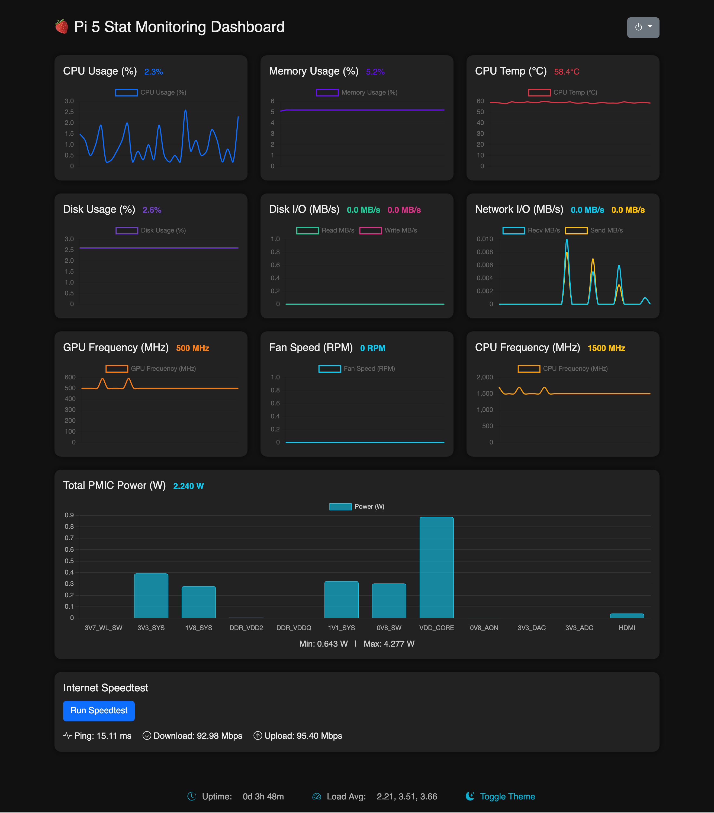
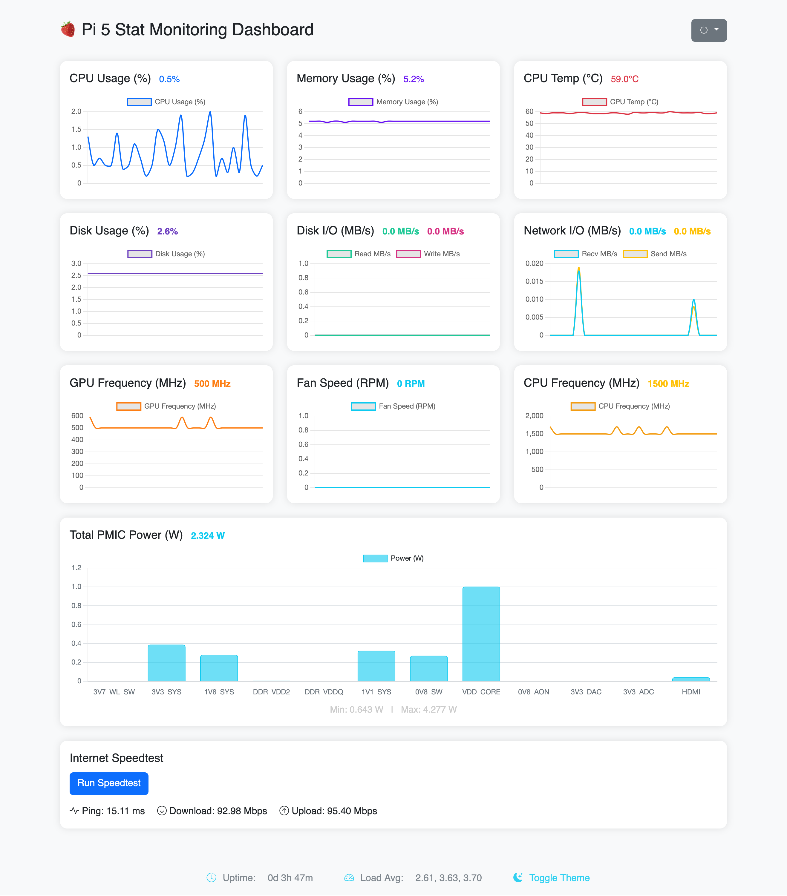

> [!NOTE]
> Forked from [g1forfun/Pi-Monitor](https://github.com/g1forfun/Pi-Monitor)

# 🍓 Pi 5 Stat Monitoring Dashboard
A real-time system monitoring dashboard built for the Raspberry Pi 5, using **FastAPI** and **Chart.js**. Tracks key performance metrics including CPU usage, memory, temperature, fan speed, network I/O, disk activity, and PMIC power draw.

---

## 📸 Screenshot

<div style="display: flex; gap: 1rem; width: 100%;">
  
  
</div>

---

## 🚀 Features

- Live-updating charts for:
  - CPU usage (%)
  - Memory usage (%)
  - CPU temperature
  - CPU and GPU frequency
  - Fan Speed (RPM)
  - Disk usage (%)
  - Disk I/O (MB/s)
  - Network I/O (MB/s)
  - PMIC power draw (W)
- Auto-min/max tracking for power
- WebSocket updates
- Bootstrap 5 + dark mode styling
- Optional floating stat indicators
- Power options:
  - Shutdown
  - Reboot
- Speedtest integration

## 🛠️ Installation

```bash
# Clone the repo
git clone https://github.com/gsidhu/pi-monitor.git
cd pi-monitor

# Create virtual environment
python3 -m venv venv
source venv/bin/activate

# Install dependencies
pip install -r requirements.txt

# Run it (dev mode) and visit http://<PI_IP_ADDRESS>:5000
python app.py

# For production, use uvicorn in a system service:
sudo cp pi-monitor.service /etc/systemd/user/
systemctl --user enable pi-monitor.service
systemctl --user start pi-monitor.service
```
